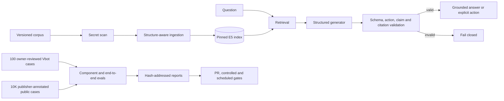

# Vbot RAG Eval Harness

Eval-gated retrieval-augmented generation for the Vbot platform's internal
knowledge base. Retriever and prompt changes go through the **same
eval-gated promotion CI** as the [model gateway](https://github.com/p1tap/vbot-model-gateway)
and [backbone fine-tunes](https://github.com/p1tap/vbot-model-lab) — third
system under the gate.

**This is not another LangChain demo.** It's a RAG service whose config
changes (chunking, k, the answer prompt) are promotion-gated by frozen
eval metrics: retrieval recall and MRR (deterministic, free), plus
LLM-judged correctness, faithfulness, and abstention behavior. CI runs
the gate with no GPU, no API keys, no LLM calls — the same gate-on-artifact
pattern used across the Vbot MLOps platform.

## Architecture



Key design decisions:

- **Stable evidence identity** — V2 labels point to exact evidence spans and
  retain heading identity, so retrieval and citation failures are separable.
- **Asymmetric dense retrieval** — the pinned E5 revision uses `query:` and
  `passage:` prefixes, explicit mean pooling, and L2 normalization.
- **Strict structured generation** — an answered response is ordered atomic
  claims with prompt-local citations. Invalid JSON, actions, or citation IDs
  cannot leak as prose.
- **Split support and coverage judging** — generated-claim support and missing
  required facts are scored independently. The selected cross-family cascade
  was calibrated against 175 frozen human verdicts.
- **Scoped evidence** — Vbot, HotpotQA, Natural Questions, and FEVER retain
  separate corpora and metrics; a large public suite cannot hide a weak domain
  result.
- **Artifact-gated CI** — ordinary CI has no LLM keys. It reproduces
  deterministic work and verifies frozen paid/local artifacts and promotion
  decisions.

See [`docs/architecture.md`](docs/architecture.md) for trust boundaries and
index cutover, and [`docs/system-card.md`](docs/system-card.md) for component
selection, intended uses, and limitations.

## Accepted V1 baseline

| Metric | Baseline | Config |
|--------|----------|--------|
| recall@k | 0.974 | chunk_max=180, overlap=40, k=4 |
| MRR | 0.844 | e5-small-v2 embeddings |
| answer_rate | 1.000 | Llama 3.1 8B (OpenRouter) |
| correctness | 0.926 | 49 questions (38 answerable, 11 abstention) |
| faithfulness | 0.926 | Judge: Gemini 2.5 Flash-Lite |
| abstention | 0.909 | — |

This remains the accepted legacy baseline: 49 hand-written questions covering 3 corpus documents
(gateway README, backbone fine-tune plan, backbone findings). ~10
out-of-corpus questions that the system must refuse — the RAG equivalent
of the calibration lane in the fine-tune eval.

### V1 provenance freeze

Phase 0 records the accepted V1 source at commit
`9e2af0644b43bd60407ac4e2e641d7872f10564e`. The machine-readable
[`baselines/v1/run-manifest.json`](baselines/v1/run-manifest.json) links the
source tree, input hashes, model identities, original report, clean CPU
reproduction, dependency snapshot, and known failures.

The deterministic lane was reproduced from a `git archive` of that commit in
an isolated Python 3.11 environment with the model cache offline: Recall@4
`0.974` and MRR `0.844`, both at exact zero delta. The embedding model is now
pinned to Hugging Face revision
`ffb93f3bd4047442299a41ebb6fa998a38507c52`.

The freeze is deliberately honest about evidence that cannot be recovered:
the exact package set for the original paid LLM run, immutable provider-side
generator/judge revisions, and raw judge rationales were not captured. See
[`baselines/v1/known-failures.md`](baselines/v1/known-failures.md) rather than
retroactively changing the accepted scores.

Verify the freeze without API keys:

```bash
python scripts/verify_v1_manifest.py
python scripts/check_repro.py \
  --recomputed baselines/v1/reproduction-report.json
```

## V2 data foundation

V2 data is versioned separately from the accepted V1 report. The current
`2.0.0-dev.5` dataset preserves 100 owner-approved development cases: the 49
visible V1 cases upgraded losslessly to atomic span labels plus 51 reviewed
lane-expansion cases. It also adds a frozen 50-case AI-authored/AI-reviewed
release set created before candidate evaluation and 12 frozen same-agent AI
observed-failure adversarial regressions. Neither partition is new human review
or independent ground truth. Genuine real-user and reserve evidence remain
absent.

```bash
pip install -r requirements-dev.txt
python scripts/build_evidence_catalog.py --check
python scripts/migrate_v1_cases.py --check
python scripts/build_review_inventory.py --check
python scripts/build_coverage_matrix.py --check
python scripts/build_v1_review_packets.py --check
python scripts/build_phase1_candidates.py --check
python scripts/build_ai_release_seed.py --check
python scripts/build_adversarial_seed.py --check
python scripts/audit_ai_release_seed.py --check
python scripts/holdout_ledger.py --check
python scripts/check_dataset_governance.py
python scripts/validate_data.py
python -m unittest discover -s tests -p 'test_*.py'
```

The case schema records answer action, claim/evidence status, clustering,
authoring provenance, review status, and legacy round-trip hashes. The dataset
manifest pins the exact corpus and evidence-catalog fingerprints. All 100
owner-approved cases now have atomic claims and exact reviewed spans in
[`evals/v2/reviewed/vbot-human-reviewed-100.jsonl`](evals/v2/reviewed/vbot-human-reviewed-100.jsonl).
See [`docs/evaluation-contract.md`](docs/evaluation-contract.md)
for the behavior, partition, authority, and promotion contract.

Phase 1 governance also includes a dataset card, annotation and failure
handbooks, threat model, coverage matrix, append-only sealed-access ledger,
and deterministic V1 review packets. Model proposals remain separate from
human decisions. The owner has frozen this 100-case human seed; future
AI-reviewed expansion retains separate provenance and cannot increase the
human-reviewed count. All 15 planned lanes and all 19 current corpus headings
have at least one approved development case.

## Public human-annotated benchmark track

The out-of-domain track is deliberately separate from Vbot gold. Its target is
10,000 public cases: 5,000 Natural Questions, 3,000 HotpotQA, and 2,000 FEVER.
These cases inherit human-annotation provenance from their publishers; they
are not represented as locally human-reviewed Vbot questions.

The full 10,000-case import is complete at the machine-validation layer:

| Benchmark | Cases | Preserved supervision | Conversion loss |
|-----------|------:|-----------------------:|----------------:|
| Natural Questions dev | 5,000 | 25,000 annotation votes; 3,410 evidence spans | 0 |
| HotpotQA distractor dev | 3,000 | 7,311 supporting-sentence references | 0 |
| FEVER shared-task dev | 2,000 | 3,213 evidence-set votes; 2,281 evidence spans | 0 |
| **Total** | **10,000** | **31,213 votes/sets; 13,002 evidence spans** | **0** |

All 10,000 normalized case IDs are unique. The large normalized retrieval
contexts remain ignored local artifacts. The exact evaluated question text and
publisher provenance are published in the compact
[`question manifest`](reports/public-benchmarks/end-to-end-10000-specialist-promoted.questions.jsonl),
while pinned source manifests, normalized checksums, distributions, and
conversion results are captured in the scrubbed reports under
[`reports/public-benchmarks`](reports/public-benchmarks). The combined machine
audit is
[`public-suite-10000.json`](reports/public-benchmarks/public-suite-10000.json).

The end-to-end public evaluation is claim-ready. A 48-case stratified adapter
sample passed a local AI semantic audit; the report explicitly records zero
locally human-reviewed public cases. The promoted specialist report evaluates
all 10,000 cases with zero fail-closed cases and reaches **60.50% strict macro
joint answer-and-citation correctness**. Its benchmark scores are 63.90% FEVER,
60.53% HotpotQA, and 57.06% Natural Questions.

The earlier task-aware composition raised the corrected 49.04% DeepSeek
baseline to 50.13%. Task-specific answer selection and supporting-evidence
retrieval then raised that result to 60.50%; each specialist passed its declared
development and disjoint-confirmation gate before full-suite composition. The
original local Qwen full-run baseline was 31.87%. Natural Questions evidence
correctness accepts any one complete non-null human annotation, matching the
official alternative-annotation rule; the former union requirement remains a
legacy diagnostic. The independent specialist audit recomputed every metric,
confirmed 10,000 unique IDs, and passed the 60% macro gate. See the
[`promoted report`](reports/public-benchmarks/end-to-end-10000-specialist-promoted.json),
[`case-level results`](reports/public-benchmarks/end-to-end-10000-specialist-promoted.cases.jsonl),
and [`independent audit`](reports/public-benchmarks/end-to-end-10000-specialist-promoted-audit.json).

### Separate single-hop reader lane

SQuAD 2.0 is reported separately because the official paragraph is supplied to
the reader and retrieval is not evaluated. On a frozen 1,000-case sample of the
official development set, a pinned local SQuAD-2.0-fine-tuned extractive reader
reaches **91.08% token F1**, **87.50% exact match**, and 94.1% answerability
accuracy with zero fail-closed cases. This public development-set result is not
a blinded out-of-domain test and must not be compared directly with the
retrieval-inclusive 10,000-case macro joint score. See the
[`confirmation report`](reports/public-benchmarks/squad-v2-oracle-context-deberta-v3-large-confirmation-1000.json)
with its exact [`question manifest`](reports/public-benchmarks/squad-v2-oracle-context-deberta-v3-large-confirmation-1000.questions.jsonl),
and the
[`paired comparison`](reports/public-benchmarks/comparisons/squad-v2-oracle-context-deberta-v3-large-confirmation-1000.json).

A direct GPT-5.6 Sol candidate path now uses OpenAI's Batch/Responses API with
one case per request, token-aware shards, hash-bound input/output/error
artifacts, and retry-only-failures. Four frozen standard/pro and high/xhigh
profiles prevent the highest-cost setting from being promoted without evidence.
See [`docs/openai-batch-evaluation.md`](docs/openai-batch-evaluation.md). No paid
GPT-5.6 result is claimed until its staged smoke, 300-case bakeoff, disjoint
confirmation, and full-run gates pass.

Validate the committed registry, normalized-case schema, and adapter fixture:

```bash
python -m scripts.benchmarks.check
python -m unittest discover -s tests -p 'test_public_benchmarks.py'
python -m scripts.benchmarks.audit_suite
python -m scripts.benchmarks.build_spot_audit
```

Rebuild an ignored normalized artifact from its pinned source after downloading
the registry artifacts:

```bash
python -m scripts.benchmarks.prepare \
  --benchmark hotpotqa \
  --input artifacts/benchmarks/hotpotqa/raw/hotpot_dev_distractor_v1.parquet \
  --output artifacts/benchmarks/hotpotqa/normalized/hotpotqa-dev-distractor-3000.jsonl \
  --report artifacts/benchmarks/hotpotqa/reports/hotpotqa-dev-distractor-3000.json \
  --limit 3000
```

The same command accepts `--benchmark natural_questions` and
`--benchmark fever`; their pinned inputs and expected manifests are recorded in
the registry and committed reports.

### Public retrieval scopes

The runner does not pretend these benchmarks have one interchangeable corpus:

- HotpotQA distractor ranks the ten documents supplied with each question.
- Natural Questions ranks long-answer candidates supplied for that question's
  Wikipedia page.
- FEVER ranks against a separately built global index of all 5,396,106 pages in
  the pinned June 2017 Wikipedia dump. The FEVER runner fails closed if that
  index or any selected gold page is missing.

Run the dependency-free lexical baselines:

```bash
python -m scripts.benchmarks.run_retrieval --benchmark hotpotqa
python -m scripts.benchmarks.run_retrieval --benchmark natural_questions
python -m scripts.benchmarks.build_fever_index
python -m scripts.benchmarks.run_retrieval --benchmark fever
```

Build and score the pinned E5 candidate indexes for the bounded tasks:

```bash
python -m scripts.benchmarks.run_dense_retrieval --benchmark hotpotqa
python -m scripts.benchmarks.run_dense_retrieval --benchmark natural_questions
```

Reports keep `case_recall_any`, `case_recall_all`, evidence recall, and MRR
separate. `case_recall_all` is the important multi-evidence guardrail: finding
one Hotpot support page does not mean the retriever found the complete chain.

Current BM25 retrieval-only baselines at `k=4`:

| Benchmark/scope | Answerable cases scored | Any support | Complete support | Evidence recall | MRR |
|-----------------|------------------------:|------------:|-----------------:|----------------:|----:|
| HotpotQA / 10 supplied distractors | 3,000 | 0.9817 | 0.5930 | 0.7873 | 0.8847 |
| Natural Questions / page candidates | 2,945 | 0.4577 | 0.3983 | 0.4275 | 0.3055 |
| FEVER / 5,396,106-page Wikipedia | 1,374 | 0.6892 | 0.6179 | 0.6513 | 0.5614 |

The committed quality-only evidence is under
[`reports/public-benchmarks/retrieval`](reports/public-benchmarks/retrieval).
These are retriever results, not answer-correctness or end-to-end RAG results.

HotpotQA retriever comparison at `k=4`:

| Retriever | Any support | Complete support | Evidence recall | MRR |
|-----------|------------:|-----------------:|----------------:|----:|
| BM25 | 0.9817 | 0.5930 | 0.7873 | 0.8847 |
| Pinned E5-small-v2 | 0.9897 | **0.7617** | **0.8757** | 0.9341 |
| BM25 + E5 RRF | **0.9920** | 0.7447 | 0.8683 | **0.9393** |

RRF improves first-hit ranking but loses complete-chain recall against E5
alone, so it is not an automatic promotion. The comparison remains open until
Natural Questions dense/hybrid results and end-to-end behavior are available.

Natural Questions retriever comparison at `k=4`:

| Retriever | Any support | Complete support | Evidence recall | MRR |
|-----------|------------:|-----------------:|----------------:|----:|
| BM25 | 0.4577 | 0.3983 | 0.4275 | 0.3055 |
| Pinned E5-small-v2 | **0.7368** | **0.6723** | **0.7042** | **0.5643** |
| BM25 + E5 RRF | 0.6530 | 0.5810 | 0.6169 | 0.4789 |

E5 wins every tracked Natural Questions metric. RRF is rejected over E5: at
`k=4`, complete-support recall falls by 0.0913 and evidence recall by 0.0873.
Across both bounded public tasks, pinned E5 is therefore the current retrieval
candidate; FEVER retains its separate global two-stage BM25 baseline pending a
scalable dense global-corpus experiment.

The deterministic retrieval gate enforces benchmark/scope/source identity and
treats complete-support and evidence recall as guardrails:

```bash
python -m scripts.benchmarks.compare_retrieval_gate \
  --baseline reports/public-benchmarks/retrieval/hotpotqa-bm25.json \
  --candidate reports/public-benchmarks/retrieval/hotpotqa-e5-small-v2.json
```

At `k=4` it promotes E5 over BM25 on both HotpotQA and Natural Questions, but
rejects RRF over E5 because the hybrid's complete-support and evidence-recall
regressions exceed the 0.005 tolerance.

## V2 structured answer evaluation

The next evaluation path no longer accepts an opaque free-form answer plus one
global judge score. It requires exact JSON, ordered atomic claims, and at least
one supplied source citation for every answered claim. Deterministic validation
rejects malformed output, uncited claims, duplicate claims, and nonexistent
citations before the claim judge runs. The judge then scores generated-claim
support and required-claim coverage separately, retaining raw output, input
hashes, model identity, retries, tokens, latency, and provider-reported cost.

The frozen V1 evaluator remains unchanged for reproducibility. V2 is a separate
development path. Its 175 human calibration verdicts are frozen. A later GLM
5.2 calibration selected an xhigh Baidu primary with the existing cross-family
failure cascade: 78.3% overall and 86.5% confirmation agreement, zero observed
false accepts, and 12 invalid/unresolved tasks failed closed. StreamLake passed
a provider-parity gate at 99.35% paired decision agreement and is the ordered
operational fallback; provider-pinned evaluation runs still disable fallback.
See [`docs/structured-evaluation.md`](docs/structured-evaluation.md).

The selected local Qwen development policy reached 100% contract validity,
88% action accuracy, zero false answers, and an 8.86% false-refusal rate on the
100-case human-reviewed development set. Its one-time 50-case AI-only release
run reached 100% contract validity, 90% action accuracy, zero false answers,
and 11.90% false refusals. The 12 known-failure adversarial regressions then
rejected the action policy at 58.33% accuracy: credential disclosure remained
blocked, but prompt injections were conservatively misclassified and two
answerable controls were refused. The local same-family Qwen judge was also
rejected (59.43% validity, five high/critical false accepts), so no local
semantic-answer-quality claim is made from it.

```bash
# Run the frozen owner-reviewed seed.
python scripts/run_structured_eval.py \
  --cases evals/v2/reviewed/vbot-human-reviewed-100.jsonl \
  --generator-profile gpt-5.4-high

# Fully local, weights-pinned generator path.
export RAG_LLM_BASE_URL=http://localhost:11434
export RAG_LLM_KEY=ollama
python scripts/run_structured_eval.py \
  --cases evals/v2/reviewed/vbot-human-reviewed-100.jsonl \
  --generator-profile qwen3.5-9b-local --skip-judge

# Explicit development-only smoke run; report is stamped release-ineligible.
python scripts/run_structured_eval.py --allow-unreviewed --limit 5
```

## Promotion Gate

The gate (`scripts/compare_gate.py`) compares a candidate eval-report
against the committed baseline:

| Exit Code | Decision | Meaning |
|-----------|----------|---------|
| 0 | **PROMOTE** | No metric regressed beyond tolerance |
| 1 | **NEEDS_REVIEW** | Soft metric slipped within review band |
| 2 | **REJECT** | Guardrail metric regressed |

**Guardrail metrics** (regression → REJECT): `correctness`, `abstention`
— did we answer right, and did we refuse the unanswerable. Same
safe-and-correct guarantee the fine-tuning gate applies to calibration +
general quality.

**Soft metrics** (small dip → REVIEW, large dip → REJECT): `recall@k`,
`MRR`, `faithfulness`, `answer_rate`.

**Noise floor**: LLM-judged metrics are not run-to-run deterministic even
at temperature 0 — the same config was measured flipping one abstention
item between runs (provider-side inference varies). On an 11-item lane a
single flip moves the metric by 0.091, so the effective tolerance is
`max(tol, 1.5 / lane_size)` per metric: a regression only counts when it
exceeds one item's worth of noise.

### Demo PRs

Two demo branches demonstrate the gate in action:

1. **`demo/improve-recall`** — Smaller chunks (90 words, overlap 25)
   reduce topic dilution. Fixes q13 (fact previously diluted in an
   oversized section), MRR 0.844→0.890, recall holds at 0.974. Gate
   decision: **PROMOTE**.

2. **`demo/reject-low-k`** — `TOP_K=1` looks like a latency win but
   collapses retrieval (recall 0.974→0.737) and with it the correctness
   guardrail (0.926→0.726). Notably, faithfulness *rises* to 0.979:
   starved of context the system abstains rather than hallucinates — a
   faithfulness-only eval would have promoted this change. Gate
   decision: **REJECT**.

## Quick start

```bash
# 1. Build the embedded index (local E5, no API key needed)
python scripts/build_index.py

# 2. Query the legacy interactive path
python scripts/query.py "What is the gateway's failover ladder?"

# 3. Run the accepted V1 eval (needs a configured provider for generation/judge)
export OPENROUTER_API_KEY=sk-or-...
python scripts/run_eval.py

# 4. Retrieval metrics only (free, deterministic, no API key)
python scripts/run_eval.py --no-llm

# 5. Compare against baseline
python scripts/compare_gate.py
# exit 0 = PROMOTE, 1 = NEEDS_REVIEW, 2 = REJECT

# 6. Promote only after reviewing the evidence and a successful gate
python scripts/promote_baseline.py
```

For V2 data validation and structured evaluation, use the commands in the V2
sections above. To serve the shared retrieval/generation path locally:

```powershell
$env:RAG_LLM_BASE_URL='http://localhost:11434'
$env:RAG_LLM_TRANSPORT='ollama_native'
$env:RAG_SERVICE_GENERATOR_PROFILE='qwen3.5-9b-local'
uvicorn app.main:app --host 127.0.0.1 --port 8000
```

## Serving path

The shared LLM client supports native local Ollama and an OpenAI-compatible
provider/gateway. Set `RAG_LLM_BASE_URL` to route through the
[Vbot Model Gateway](https://github.com/p1tap/vbot-model-gateway)'s budget-capped
virtual key for per-key spend tracking:

```bash
export RAG_LLM_BASE_URL=http://127.0.0.1:4000/v1
export RAG_LLM_KEY=sk-vbot-rag-...   # gateway virtual key
```

The FastAPI service exposes liveness/readiness, version identities, retrieval,
strict structured answers, request IDs, Prometheus metrics, and structured
failures. Offline/service retrieval parity is tested against a frozen fixture.
See [`docs/service.md`](docs/service.md).

## CI workflows

`.github/workflows/rag-gate.yml` runs on relevant pull requests. It:

1. compares the committed V1 report with the accepted baseline;
2. verifies frozen V1/V2 contracts, dataset governance, the corpus secret
   scan, authentic promote/reject examples, and public adapter fixtures;
3. recomputes the promoted 10,000-case specialist RAG result, the separate
   1,000-case SQuAD reader confirmation, and the visible adversarial rejection
   from their committed case-level artifacts;
4. rebuilds the index with pinned CPU dependencies and reproduces retrieval;
5. runs the complete unit suite and emits a readable step summary.

`rag-controlled-retrieval.yml` is a manual, artifact-producing V2 retrieval
lane over only the reviewed 100-case dataset. `rag-scheduled-audit.yml` repeats
the deterministic frozen-contract/security/test audit weekly. None of these
workflows holds provider keys or silently reruns non-deterministic judges.

## Corpus

| Document | Sections | Source |
|----------|----------|--------|
| `gateway-readme.md` | Gateway architecture, deploy runbook, k8s, GitOps, findings | [vbot-model-gateway](https://github.com/p1tap/vbot-model-gateway) |
| `backbone-plan.md` | Fine-tune plan, dataset spec, training, evaluation | [vbot-model-lab](https://github.com/p1tap/vbot-model-lab) |
| `backbone-findings.md` | SFT sweep findings, DPO ablation results | [vbot-model-lab](https://github.com/p1tap/vbot-model-lab) |

The manifest classifies these snapshots as public-safe and binds a passing
high-confidence credential scan. The scanner is a guardrail, not proof that
arbitrary prose can never contain sensitive information; that limitation is
recorded in the manifest and threat model.

## Project Structure

```text
├── app/                       # FastAPI production and opt-in mock services
├── benchmarks/                # public registry, schemas and tiny fixtures
├── corpus/                    # documents, manifest and span catalog
├── evals/                     # V1 gold plus frozen V2 contracts/partitions
├── rag/
│   ├── retrievers/            # common BM25, dense and fusion interfaces
│   ├── benchmarks/            # normalized public benchmark adapters
│   ├── embed.py               # pinned E5 implementation
│   ├── retrieve.py            # validated immutable-index retrieval
│   ├── structured_answer.py   # strict answer/action/citation contract
│   └── llm.py                 # native Ollama + compatible-provider client
├── reports/                   # scrubbed decisions and measured evidence
├── scripts/                   # builders, runners, audits, gates and reports
├── tests/                     # data, evaluator, service and regression tests
└── .github/workflows/         # PR, controlled and scheduled CI lanes
```
