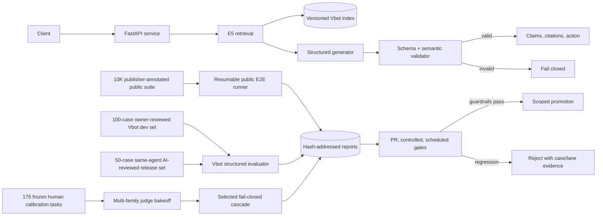

# RAG evaluation and serving architecture

The online path and offline Vbot evaluator share the same E5 index,
`structured_answer` generator, source IDs, and semantic validator. The public
runner has a task-specific batch contract because HotpotQA/Natural Questions
are extractive QA while FEVER is label prediction. Both paths retain raw model
output and exact model/runtime provenance in offline reports; the service never
returns raw provider output to clients.

## Trust boundaries

- Retrieved text is untrusted data, never instructions.
- Only prompt-local citation IDs supplied with a request may be returned.
- Invalid JSON, unknown citations, missing claim support, or unavailable
  dependencies fail closed.
- Public benchmark annotations retain publisher provenance. They are not
  relabeled as local human review.
- The 100-case Vbot development set and 175 judge-calibration decisions are the
  only locally human-reviewed artifacts.
- The 50-case release set is separately marked AI-authored/AI-reviewed and
  never increases that human-review count.
- The public corpus is restricted to manifest-listed files and is gated by a
  deterministic high-confidence secret scan.

## Index cutover

The service loads one immutable index snapshot during process lifespan and
warms E5 before readiness. Rebuilds happen out of process. A new process must
report the intended index/corpus fingerprints at `/version` and pass
`/health/ready` before traffic switches; the old process remains available for
rollback.
